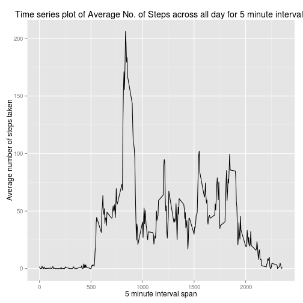

# Reproducible Research: Peer Assessment 1

##### Necessary imports


```r
# More about lubridate package can be found here https://cran.r-project.org/web/packages/lubridate/lubridate.pdf
# A tutorial resource for dplyr is here https://cran.rstudio.com/web/packages/dplyr/vignettes/introduction.html

library(ggplot2)
library(lubridate)
library(dplyr)
```
## Loading and preprocessing the data

##### Step 1: Data reading into memory


```r
# Simple reading; if activity.csv is missing in working directory, we unzip and read

if(!file.exists('activity.csv')){
    unzip('activity.zip')
}
activity <- read.csv("activity.csv")
```
## What is mean total number of steps taken per day?


```r
# Using dplyr select() here; variables of interest are steps and date

steps_subset <- select(activity, steps, date)

grouped_steps_subset <- group_by(steps_subset, date)

# Making an aggregate; all NAs removed for sake of sum computation

summary_steps <- summarize(grouped_steps_subset, total_steps = sum(steps, na.rm=TRUE))
```
##### 1. Make a histogram of the total number of steps taken each day


```r
# Binwidth set to 500 for this histogram

qplot(summary_steps$total_steps, xlab="Number of steps each day", ylab="Frequency of steps", main="Frequency plot of number of steps each day",binwidth = 500, fill=I("red"), alpha=I(.2), col=I("black"))
```

 


##### 2. Calculate and report the mean and median total number of steps taken per day


```r
mean_steps <- mean(summary_steps$total)
median_steps <- median(summary_steps$total)
```
* Mean total number of steps is 9354.2295082.

* Median total number of steps is 10395.


## What is the average daily activity pattern?


```r
# Steps resemble closely to those aforementioned; variables of interest are steps and interval

interval_activity <- select(activity, steps, interval)

# Interest in mean; NAs removed for sake of sum computation

interval_summary <- summarize(group_by(interval_activity, interval), averaged_steps = mean(steps, na.rm = TRUE))
```
##### 1. Make a time series plot


```r
plottable <- ggplot(interval_summary, aes(interval, averaged_steps)) + geom_line() + xlab("5 minute interval span")+
             ylab("Average number of steps taken") + ggtitle("Time series plot of Average No. of Steps across all day for 5 minute intervals")
print(plottable)
```

 

##### 2. Which 5-minute interval, on average across all the days in the dataset, contains the maximum number of steps?


```r
max_steps <- max(interval_summary$averaged_steps)

max_interval <- interval_summary[interval_summary$averaged_steps == max_steps,][1]

# Will use regexp to resolve max_interval; max_interval's type is numeric
# The interval is of the form HH:MM; however, it comes across as 100, for example, in the dataset (here 01:00)
# Regexp first looks for a group match of min 1 and max 2 digits, followed by, next group of 2 digits 
# Used gsub to match and replace; replacement string is of the form HH:MM

max_interval <- gsub("([0-9]{1,2})([0-9]{2})", "\\1:\\2" ,max_interval)
```
* The 5-minute interval, on average across all days, with maximum number of steps is at 8:35.


## Imputing missing values

##### 1. Calculate and report the total number of missing values in the dataset 


```r
total_NAs <- sum(is.na(activity$steps))
```
* Total number of missing values is 2304.


##### 2. Devise a strategy for filling in all of the missing values in the dataset.

The strategy is to replenish missing values with average of 5-minute interval.


```r
# Variables of interest are steps and interval

int_act <- select(activity, steps, interval)

grouped_ <- group_by(int_act, interval)

int_summary <- summarize(grouped_, avg_int = mean(steps, na.rm = TRUE))

# Rather than interfering with original read data set (activity) in memory, created a placeholder to compute further aptly named temp_ds (as in, temporary dataset)

temp_ds <- activity

# cleanse_NA is a function to remove NAs; its parameter is the data set with NAs

cleanse_NA <- function(ds){

    for(i in 1:nrow(ds)){
        
        # First, locate NA steps

	if(is.na(ds$steps[i])){
	
	# Second, replace the i'th NA step 
 
	ds$steps[i] <- int_summary[ds$interval[i] == int_summary$interval,][2]
	
	}

	}

	return(ds)

}
```
##### 3. Create a new dataset that is equal to the original dataset but with the missing data filled in.


```r
# Aforementioned, temp_ds itself gets cleansed and replenishes all NAs with average of intervals

temp_ds <- cleanse_NA(temp_ds)

# Variable steps in temp_ds comes across as type list; unlisted and converted to type numeric

temp_ds$steps <- as.numeric(unlist(temp_ds$steps))

sub_ds<- group_by(select(temp_ds, 1, 2), date)

summary_ds <- summarize(sub_ds, total=sum(steps))
```
##### 4. Make a histogram of the total number of steps taken each day


```r
qplot(summary_ds$total, xlab="Number of steps each day", ylab="Frequency of steps",main="Frequency plot of number of steps each day (imputed)",binwidth = 1000, fill=I("red"), alpha=I(.2), col=I("black"))
```

 

##### 5. Calculate and report the mean and median total number of steps taken per day. 


```r
imputed_mean <- mean(summary_ds$total)
imputed_median <- median(summary_ds$total)
```
* Imputed Mean is 1.0766189 &times; 10<sup>4</sup>.
* Imputed Median is 1.0766189 &times; 10<sup>4</sup>.


## Are there differences in activity patterns between weekdays and weekends?


##### 1. Create a new factor variable in the dataset with two levels – “weekday” and “weekend” indicating whether a given date is a weekday or weekend day.


```r
# Day_of_Week is of type factor with two levels: weekday and weekend

Day_of_Week<- factor(ifelse(wday(ymd(temp_ds$date)) %in% c(2:6), 'weekday', 'weekend'))

updated_ds <- cbind(temp_ds, Day_of_Week)

s_cols<- select(updated_ds, 1, 3:4)

s_cols <- group_by(s_cols, interval, Day_of_Week)

s_cols$steps <- as.numeric(unlist(s_cols$steps))

summary_cols <- summarize(s_cols, mean_interval=mean(steps))
```

##### 2. Make a panel plot containing a time series plot


```r
print(ggplot(summary_cols, aes(interval, mean_interval)) + 
    geom_line() + 
    facet_grid(Day_of_Week ~ .) +
    xlab("5 minute interval") + 
    ylab("Average number of steps") + ggtitle("Panel plot of time-series distinguishing Weekday vs Weekend"))
```

 


